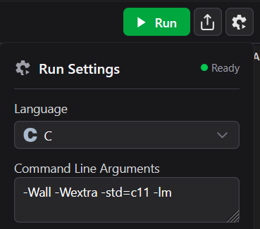

# comp-1411
A repository to help students in COMP-1411 learn to program.

## Running Code

### Online
I recommend using [this link](https://www.online-cpp.com) to run these files online (and for general use).

>[!IMPORTANT]
>Click on the ⚙️ icon and paste the following Command Line Arguments:
>```
>-Wall -Wextra -std=c11 -lm
>```
>
>

### Local
I use the following command when executing any of the `.c` files in this repository:

```bash
gcc -Wall -Wextra -std=c11 ${FILENAME} -lm -o exe_${FILENAME_WO_EXT} && ./exe_${FILENAME_WO_EXT}
```

| Component | Description |
|---|---|
| `gcc` | GNU C compiler used to compile C source code. |
| `-Wall` | Enables common compiler warnings. |
| `-Wextra` | Enables additional compiler warnings. |
| `-std=c11` | Compiles the code using the C11 standard. |
| `${}` | Shell syntax for variable substitution. |
| `FILENAME` | Variable containing the C source filename. |
| `FILENAME_WO_EXT` | Variable containing the filename without the `.c` extension. |
| `-lm` | Links the math library (`libm`). |
| `-o` | Specifies the output executable name. |
| `exe_` | Prefix added to the compiled executable name. |
| `&&` | Runs the next command only if the previous command succeeds. |
| `./` | Executes a program from the current directory. |